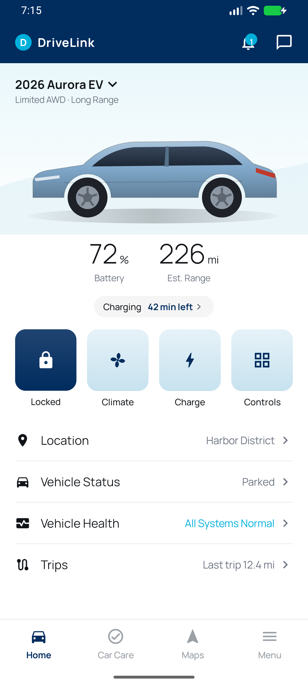
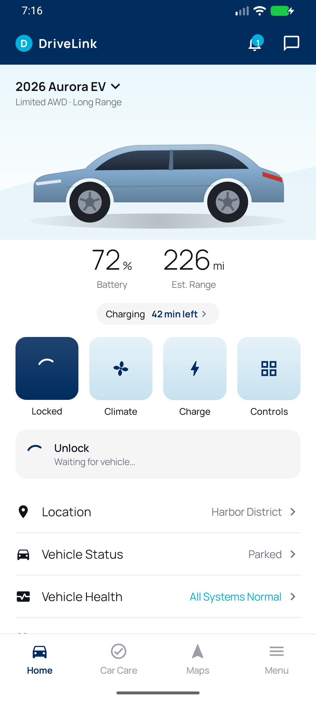
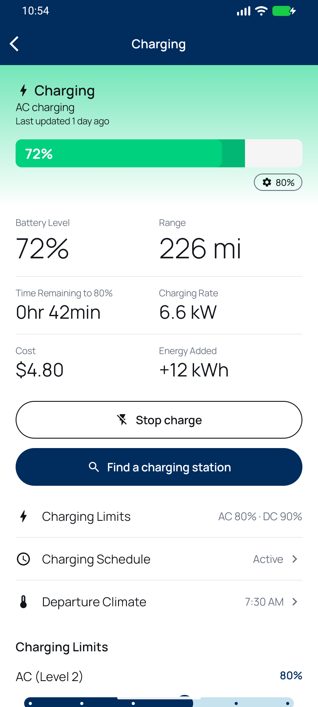
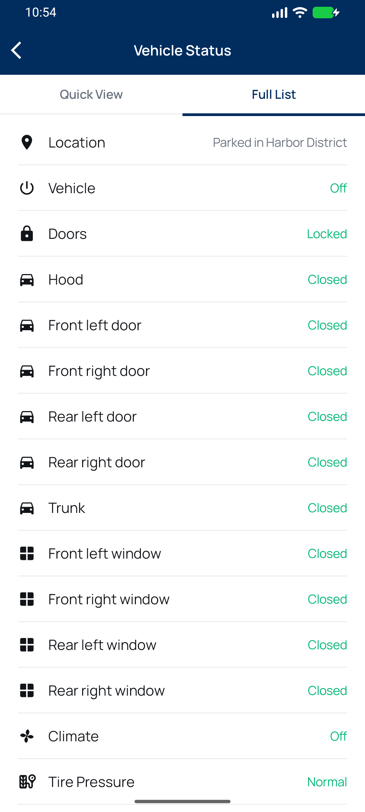
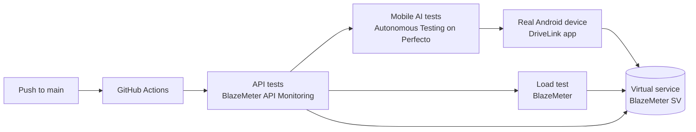

# DriveLink Demo

[](https://github.com/benjithompson/drivelink-demo/actions/workflows/continuous-testing.yml)

DriveLink is an Android connected-car app: remote lock and unlock, remote start with climate, EV charging, vehicle status, trips, alerts and service requests. It is a test target for the Perforce continuous testing platform.

The app does not need a real car or a real OEM backend. Every backend call goes to a **BlazeMeter virtual service** that acts as the car and the cloud. The virtual service keeps state per car, so a command changes what the next status shows. It also simulates failures on request: a slow vehicle, an offline vehicle, a failed command, an expired session, rate limits and server errors.

<p>
  
  
  
  
</p>

## The platform

| Product | What it does here | Where |
| --- | --- | --- |
| BlazeMeter Service Virtualization | Serves the full DriveLink API from the OpenAPI contract: 131 transactions, 14 scenarios, state for 501 cars | [mock/](mock/), [docs/mock-service.md](docs/mock-service.md) |
| BlazeMeter API Monitoring | API tests check that the virtual service is up and answers correctly. A health check runs every 15 minutes. | [scripts/ci/api_monitoring.py](scripts/ci/api_monitoring.py) |
| Perforce Autonomous Testing | Tests written as plain-language prompts. AI runs them on a real Perfecto device. | [perfecto/autonomous/](perfecto/autonomous/) |
| Perfecto | Real Android devices in the cloud. Also runs the Espresso core suite. | [perfecto/](perfecto/) |
| BlazeMeter performance testing | A JMeter test sends app traffic to the virtual service: sign-in, status refresh, remote commands. | [load/](load/) |
| PAG (MCP gateway) | Gives AI assistants one MCP connection to Perfecto, Autonomous Testing and BlazeMeter | — |



## Continuous testing pipeline

[.github/workflows/continuous-testing.yml](.github/workflows/continuous-testing.yml) runs on each push to `main` and on demand (**Actions → Continuous testing → Run workflow**). Each stage is small, so the pipeline finishes in minutes.

| Stage | Runs | Checks | Typical time |
| --- | --- | --- | --- |
| 1. API tests | First. The other stages need it. | Health check, then sign-in → vehicle list → vehicle status with 7 assertions | Under 1 min |
| 2a. Mobile AI tests | After stage 1, parallel to 2b | Autonomous Testing suite "DriveLink – CI": install the app, sign in, check the dashboard | About 6–10 min |
| 2b. Load test | After stage 1, parallel to 2a | 5 users for 2 minutes. Fails if p95 of the status call is over 1,500 ms or errors are over 1 %. | About 5 min, with engine start |

Each job writes its result and a link to its report to the run summary. A manual run can skip the mobile or the load stage.

### Setup

Repository secrets (**Settings → Secrets and variables → Actions**):

| Secret | Value |
| --- | --- |
| `BZM_APITEST_TRIGGER_URL` | Trigger URL of the API Monitoring bucket "DriveLink" (bucket settings) |
| `BZM_APITEST_TOKEN` | API Monitoring access token |
| `PAT_AUTHORIZATION` | The `Authorization` header value for the Autonomous Testing MCP server |
| `BLAZEMETER_API_KEY_ID`, `BLAZEMETER_API_KEY_SECRET` | BlazeMeter API key |

Optional repository variables: `PAT_CLOUD` (default `demo`), `PAT_APPLICATION_ID` (227), `PAT_SUITE_ID` (587), `PAT_ENVIRONMENT_ID` (493), `BLAZEMETER_TEST_ID` (15970009).

## Repository

| Path | Content |
| --- | --- |
| [app/](app/), [core/](core/) | The Android app: Kotlin, Jetpack Compose, Hilt, Retrofit. `core/` holds the design system, domain, network, settings, data and test modules. |
| [api/](api/) | OpenAPI contract, named examples for every operation and scenario. See [docs/api.md](docs/api.md). |
| [mock/](mock/) | Virtual service exports and the per-car dataset |
| [perfecto/](perfecto/) | Espresso on Perfecto, Autonomous Testing scenarios, AI Scriptless notes |
| [load/](load/) | JMeter plan, Taurus configs, thresholds |
| [scripts/](scripts/) | Build the virtual service, smoke test it, run on Perfecto, upload builds. [scripts/ci/](scripts/ci/) holds the pipeline steps. |
| [docs/](docs/) | API and virtual service notes, app screenshots |

## Run locally

```sh
./gradlew :app:assembleDebug                      # build the app
./gradlew test                                    # unit tests
python3 scripts/mock-server.py --port 8080 &      # local mock with the same rules as the virtual service
scripts/smoke.sh http://127.0.0.1:8080            # check every operation and scenario
```

The app reads the virtual service URL from `MOCK_BASE_URL` in `secrets.properties` (gitignored). To use the local mock from an emulator, select the endpoint "local" (`http://10.0.2.2:8080`) in the app's Demo console.

Settings for Perfecto and BlazeMeter are in [perfecto/README.md](perfecto/README.md) and [load/README.md](load/README.md). Keys stay in gitignored files and are never committed.
